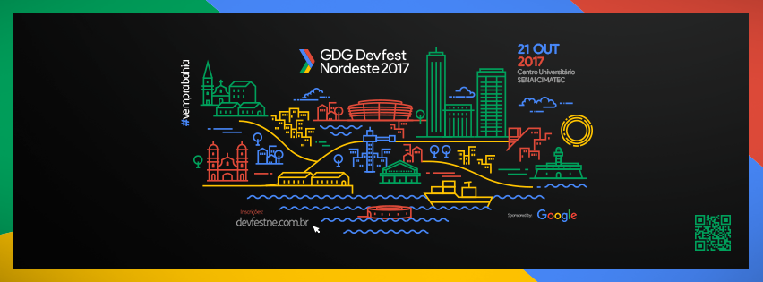

_Progressive Web App oficial da 4º edição do GDG Devfest Nordeste 2017._

___

## Setup
Esta aplicação usa o template do [`VueJS`](https://vuejs.org/) para [PWA](https://github.com/vuejs-templates/pwa). Siga as instruções abaixo para instalar e executar este projeto localmente em seu computador.

1. Instale o [`NodeJS`](https://nodejs.org/) na versão 4 ou superior.
2. Faça um [`fork`](https://github.com/mvfsillva/devfestne-17/fork) deste repositório.
3. Clone localmente e navegue para o diretório

``` bash
git clone https://github.com/mvfsillva/devfestne-17.git && cd devfestne-17
```
#### Dependências

Os comandos abaixos são excutados via `npm`, mas você pode usar se preferir o [`yarn`](https://yarnpkg.com/pt-BR/).

``` bash
# instalando dependências
npm install
```

Tudo pronto! Basta agora executar o projeto.

``` bash
# executando localmente o serve + hot reload no endereço localhost:8080
npm run dev

# fazer build para produção + minificação
npm run build
```
